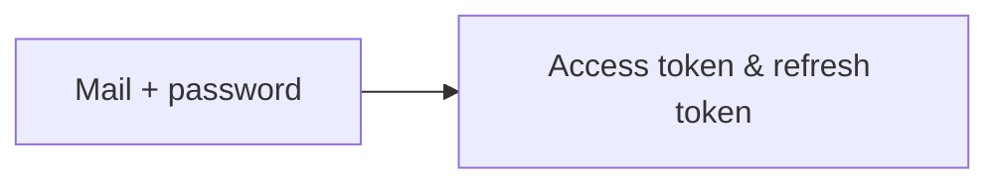
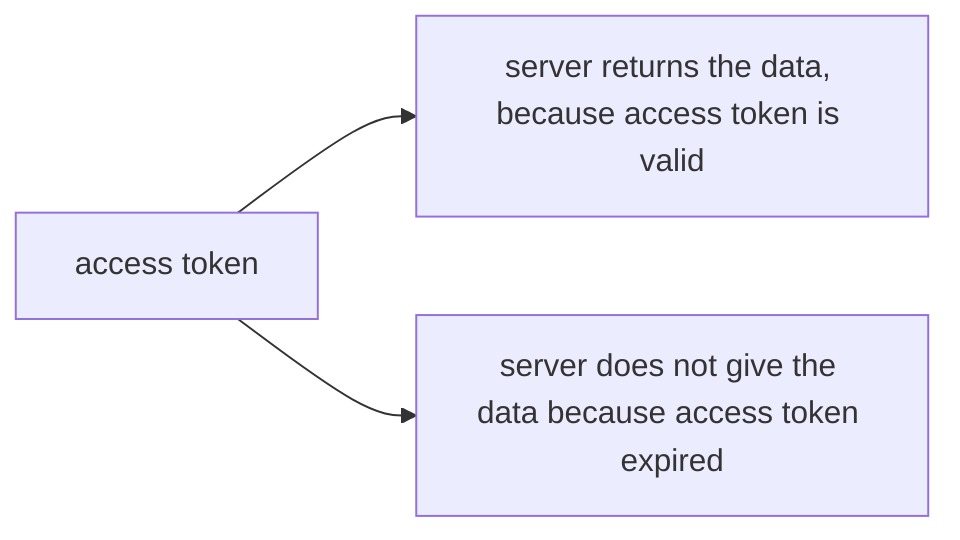
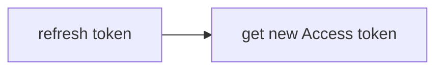
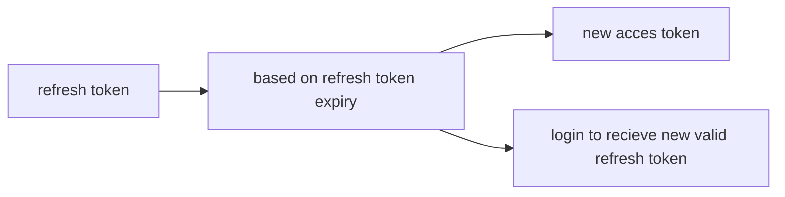

# `JWT` Authentication

First time,

After receiving these tokens


when access token is expired. we use refresh token to get new access token.


Instead of logging in again we use the refresh token to generate access token and use the app. After refresh token is expired it is absolutely needed for us to login  again.



## Fundamentals

**1. Access token** is used to access our webapp. It is usually in the **header of every request**. With `Bearer` as prefix.
```json
{
"Authorization": "Bearer <access-token>"
}
```

It has a short expiry time. Once the time expires it needs to be refreshed.
**2. Refresh token**  is used to refresh the access token. When we send a refresh token to the server it gives us a new access token. This can be decrypted to know the `user id` (incase of django)

### Case of Logging out
There is no concept of logging out.
So we need to create one. it is called blacklisting of refresh token.
we blacklist a refresh token and delete blacklisted tokens using a cron job periodically.
[Documentation to JWT Blacklist App](https://django-rest-framework-simplejwt.readthedocs.io/en/latest/blacklist_app.html)

---

1. User login screen
2. fetch post -> backend
3. token save to secure storage
4. use that to get access to /api/profile
5. then make it into a component
6. user registration screen
7. save the token
8. logout request
9. forget password flow
10. otp for mail 
11. send ing mail
12. checking otp
13. updating password 
<!--stackedit_data:
eyJoaXN0b3J5IjpbLTM1MzY2MDQ0OV19
-->