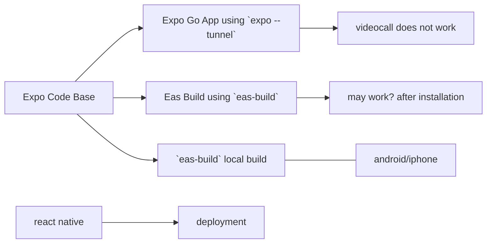

# Making Video Call Feature in `expo`

Video call feature in react native is offered by various platform but in expo the support is not readily available.

**Premise: Trial and Error**
*Option 1*
Using `eas-build` we will try to build the `.apk` and check  for android. For `ios`, we will try to find a method to test an app in iphone after building.
The idea of this method is to eliminate the process of **eject**-ing the expo app as we need the sweet abstraction from expo. We might definitely loose the live reloading in expo app but we will have video calling feature in the same bundle.

*Option 2*
We will have to leave expo environment and use pure react native which is not a bad thing at all. build, test and distribution process would be slight foreign. We need a macbook to build for IOS. oh no! we are broke developers.

*Option 3*
We can pre-cook the native code and install it as a library in expo to make it work in `expo` which will allow us to use the app even in expo go. But we have better things to spend our time.

## `eas-build` option 1

[Expo Build for ios and android]( https://www.youtube.com/watch?v=k1M2WqdpgVg)

### Android: building `.apk`for testing
  [Expo Build Feature in Android for Testing](https://www.youtube.com/watch?v=fUS_BjOHi-c)

 By building an apk we can use native code to test in our mobile phones using `eas-build` command. 
 
---
[Deploying test app for ios using `transporter`](https://www.youtube.com/watch?v=PdwYDatvJ2I)
